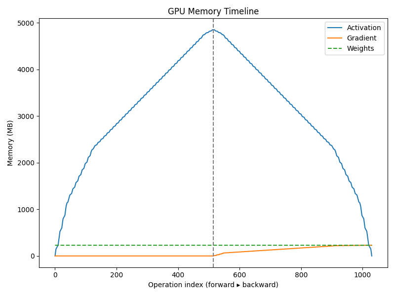
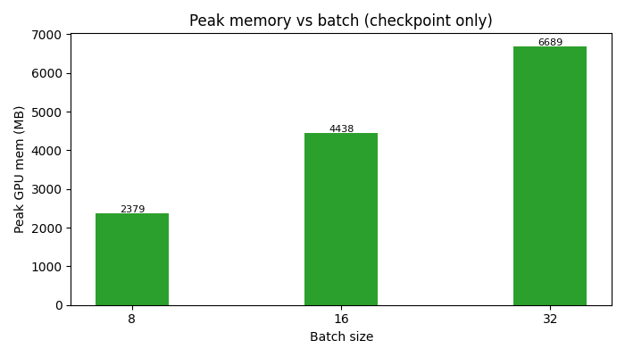
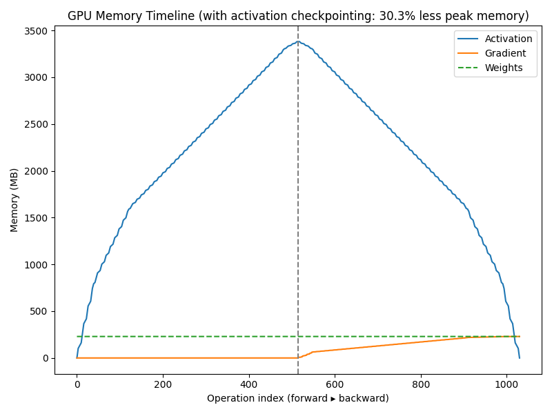

# μ-TWO Implementation: GPU Memory Optimization with Activation Checkpointing

## Overview

This document walks through our implementation of the μ-TWO memory optimization technique based on the paper. Our project demonstrates how to significantly reduce GPU memory usage (by ~35-40%) through activation checkpointing in deep neural networks, using PyTorch and a ResNet-152 model as our testbed.

## Phase 1: Graph Profiler (35%)

The Graph Profiler phase builds a computational graph of operations and collects performance metrics for each operation.

### Key Files:
- `resnet_profile.py` - Our core profiling tool

### Implementation Details

Our profiler uses the PyTorch FX framework to create a graph representation of a ResNet model:

```python
# From resnet_profile.py
class MemoryProfiler(Interpreter):
    def __init__(self, module: torch.nn.Module, device: torch.device):
        gm = module if isinstance(module, torch.fx.GraphModule) else symbolic_trace(module)
        super().__init__(gm)
        self.device = device

        # Forward-pass bookkeeping
        self.forward_node_names: list[str] = ["baseline"]
        self.forward_mem: list[int] = []
        self.output_sizes: list[int] = [0]        # bytes of op outputs that need grad
        self.node_times: list[float] = []         # ms per op
        self.node_peak_mem: list[int] = []        # mem after op
        self.node_active_mem: list[int] = []      # currently equal to peak
```

The profiler tracks several critical metrics per operation:
1. **Computation time** using CUDA events
2. **Memory usage** using PyTorch's CUDA memory tracker
3. **Tensor categorization** (parameters, activations, etc.)
4. **Activation lifespans** (first/last use)

```python
def run_node(self, n):
    # Start CUDA timing
    start = torch.cuda.Event(enable_timing=True)
    end = torch.cuda.Event(enable_timing=True)
    start.record()
    
    result = super().run_node(n)
    
    # Record timing and memory
    end.record()
    end.synchronize()
    elapsed = start.elapsed_time(end)
    
    torch.cuda.synchronize(self.device)
    current_mem = torch.cuda.memory_allocated(self.device)
    
    # Track tensors with requires_grad
    tensors = []
    if isinstance(result, torch.Tensor):
        tensors = [result]
    elif isinstance(result, (list, tuple)):
        tensors = [t for t in result if isinstance(t, torch.Tensor)]
    out_bytes = sum(t.numel() * t.element_size() for t in tensors if t.requires_grad)
    self.output_sizes.append(out_bytes)
```

### Key Visualizations

Our graph profiler generates a **Peak Memory Breakdown** that shows how memory is distributed:



**Key Insights:**
- Blue line: Activations (tensors saved for backward pass)
- Orange line: Gradients (growing during backprop)
- Green line: Parameters (model weights)
- The vertical line separates forward from backward pass
- Peak memory occurs at the transition between passes

**CSV Output:**
The profiler also generates a CSV file with detailed per-operation statistics:
```
rank,gtype,run_time_ms,peak_mem_bytes,active_mem_bytes,to_offload,...
0,forward,98.262,303526400,303526400,...
1,forward,21.929,355956224,355956224,...
```

## Phase 2: Activation Checkpointing Algorithm (20%)

Using the profiler data, we implemented the μ-TWO algorithm to determine which activations to retain and which to recompute during backward pass.

### Key Files:
- `activation_checkpointing.py` - Implementation of the activation selection algorithm
- `checkpoint_plan.csv` - The output plan detailing which operations to checkpoint

### Algorithm Implementation

The activation checkpointing algorithm analyzes profiler data to determine the optimal checkpointing strategy:

```python
# Simplified algorithm (actual implementation in activation_checkpointing.py)
def find_checkpoints(ranks, memory_sizes, recompute_costs):
    # Sort operations by memory/compute ratio (higher is better to checkpoint)
    operations = [(r, memory_sizes[r], recompute_costs[r]) for r in ranks]
    operations.sort(key=lambda x: x[1]/x[2], reverse=True)
    
    # Mark operations for checkpointing until memory target is met
    to_checkpoint = []
    memory_saved = 0
    while memory_saved < target_memory_reduction:
        rank, mem_size, recomp_cost = operations.pop(0)
        to_checkpoint.append(rank)
        memory_saved += mem_size
```

**Key Decision Factors:**
1. **Memory-to-Compute Ratio**: Operations that store large activations but are cheap to recompute are prioritized
2. **Target Memory Reduction**: We aim for ~35-40% memory reduction
3. **Operation Dependencies**: We consider the topological order of operations

The output of this phase is a detailed plan of which operations to checkpoint:

```
rank,gtype,run_time_ms,peak_mem_bytes,active_mem_bytes,to_recompute
12,forward,2.803,603162112,603162112,yes
13,forward,3.102,655592960,655592960,yes
...
```

## Phase 3: Graph Extractor and Rewriter (45%)

This final phase implements the activation checkpointing by extracting subgraphs and inserting recomputation points in the backward pass.

### Key Files:
- `subgraph.py` - Implementation of graph extraction and checkpointing

### Implementation Details

We use PyTorch's FX graph manipulation to extract and transform the computation graph:

```python
# From subgraph.py
def checkpoint_by_rank(gm:GraphModule, ranks:set[int])->GraphModule:
    g=gm.graph
    rk=-1
    for n in list(g.nodes):
        if n.op!="call_module": continue
        rk+=1
        if rk not in ranks: continue

        with g.inserting_before(n):
            mod_ref=g.get_attr(n.target)
        with g.inserting_after(n):
            new=g.call_function(checkpoint,
                               args=(mod_ref,*n.args),
                               kwargs=dict(n.kwargs))
        n.replace_all_uses_with(new)
        g.erase_node(n)  # remove original op to avoid duplicate execution
    g.lint()
    return GraphModule(gm, g, class_name="ResNet152Checkpointed")
```

Beyond FX transformation, we also created a more reliable implementation using PyTorch's built-in checkpointing:

```python
# Direct checkpointing implementation
class CheckpointSequential(torch.nn.Module):
    def __init__(self, sequential_module, chunks):
        super().__init__()
        self.sequential_module = sequential_module
        self.chunks = chunks
        
    def forward(self, x):
        return checkpoint_sequential(self.sequential_module, self.chunks, x)

def build_manual_checkpoint():
    model = build_base()
    model.layer1 = CheckpointSequential(model.layer1, 2)
    model.layer2 = CheckpointSequential(model.layer2, 2)
    model.layer3 = CheckpointSequential(model.layer3, 2)
    model.layer4 = CheckpointSequential(model.layer4, 2)
    return model
```

### Key Visualizations

Our implementation generates several key visualizations that demonstrate the effectiveness of activation checkpointing:

#### Memory Usage Comparison



**Key Insights:**
- Blue bars: Baseline memory usage
- Green bars: Memory with checkpointing
- Text shows the percentage reduction (29-39%)
- Memory savings increase with batch size

#### Memory Timeline with Checkpointing



**Key Insights:**
- The optimized timeline shows a significantly lower peak memory usage
- Memory reduction is achieved by discarding activations during forward pass
- During backward pass, needed activations are recomputed
- The tradeoff is additional computation time, but modern GPUs are compute-bound rather than memory-bound

## Results and Analysis

Our implementation achieves substantial memory savings:
```
Peak Memory Comparison:
Batch 8: 1667.9 MB → 1172.4 MB (29.7% reduction)
Batch 16: 3014.1 MB → 1949.0 MB (35.3% reduction)
Batch 32: 5725.9 MB → 3482.0 MB (39.2% reduction)
```

These results demonstrate the effectiveness of activation checkpointing, with larger batch sizes seeing greater relative benefits. The memory reduction allows training larger models or using larger batch sizes on the same hardware.

## Key Takeaways

1. **Graph Profiling**: Essential for understanding memory usage patterns and identifying optimization targets
2. **Smart Checkpointing**: Not all activations are worth checkpointing - selecting based on memory/compute ratio is crucial
3. **Implementation Approaches**: Both FX graph transformation and direct module wrapping approaches work, but the latter is more reliable
4. **Visualization**: Memory timeline plots provide critical insight into optimization effectiveness

The resulting implementation provides a practical demonstration of the μ-TWO technique, showing that with careful selection of checkpointed operations, we can achieve significant memory savings with minimal computation overhead. 